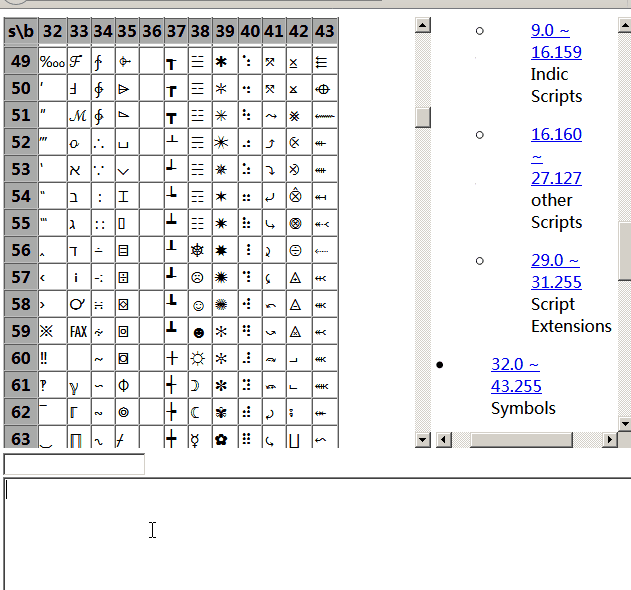

# ddnime
dot decimal notation IME
[preview](https://deqoder.github.io/ddnime/ddnime.html)

## USAGE

Type character's unicode value in dot decimal notation or "domain name"(configured in hosts.json), then type

* space: convert code to charater
* enter: clear code and no convert

If the "bottom-level domain" is configured as fixed length, you can input multiple characters at one time.

## Example

